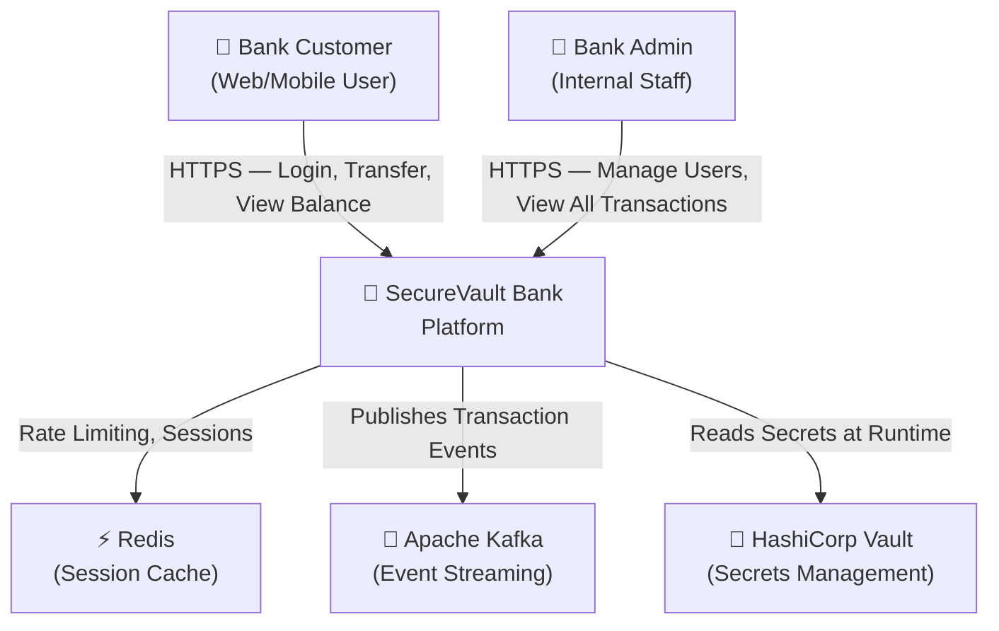
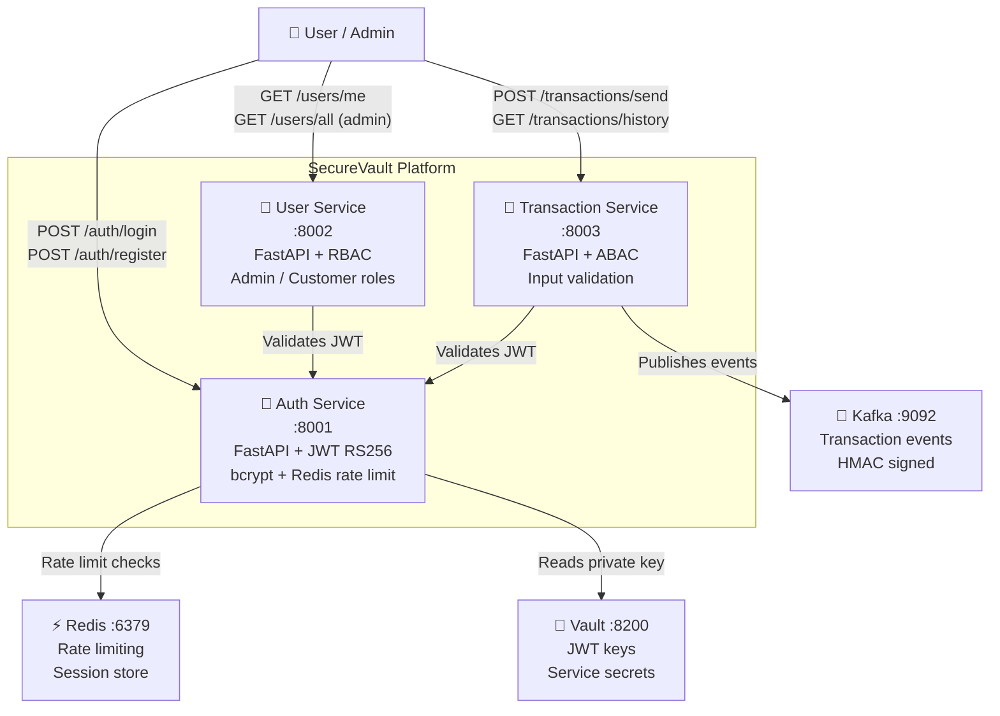
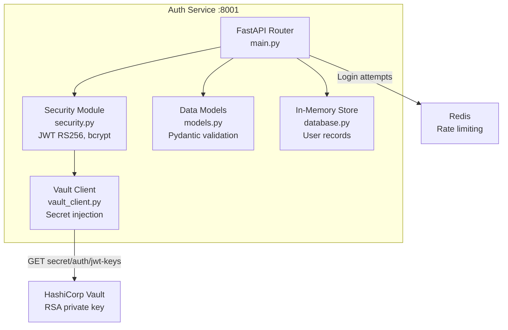
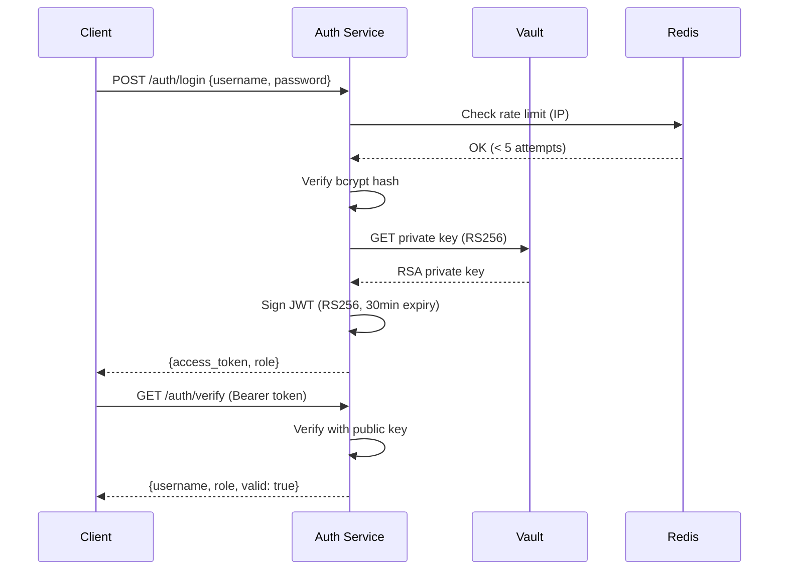

# SecureVault Bank — C4 Architecture Diagrams

## Level 1: System Context

## Level 2: Container Diagram

## Level 3: Component Diagram — Auth Service

## Level 4: Code Diagram — JWT Token Flow

